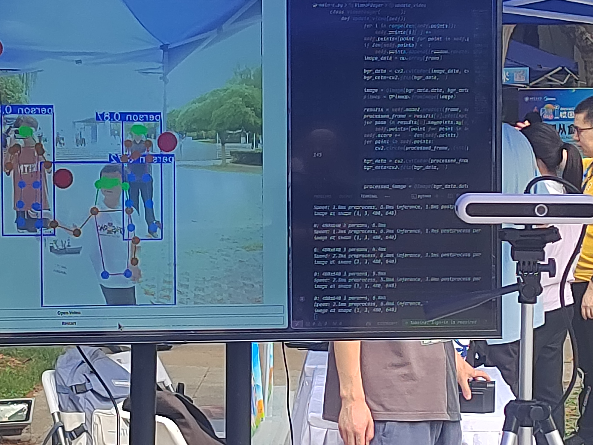
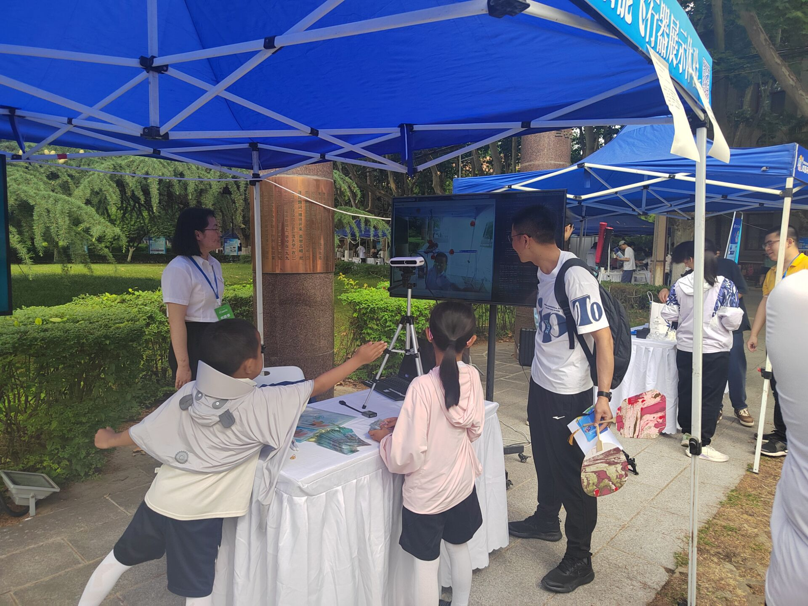

# 這是一個基於yolo-pose開發的體感小遊戲

## 這是西安交通大學 智能飛行器社團 2024 年 校園開放日視覺方向對外開放項目

基於yolo-pose我們完成了

- 人体检测: 首先利用 YOLO 目标检测模型检测出图像中的人体边界框。

- 姿态估计: 对于每个检测到的人体,YOLO-Pose 模型预测出身体 17 个关键点的坐标位置,如头部、肩膀、胳膊、腿部等。

- 多任务学习: YOLO-Pose 模型同时优化边界框检测和关键点预测两个任务,相互促进提高彼此的性能。

遊戲玩法：

- 圖像中隨機刷新出紅色小球，我們需要操控身體的十七個關鍵點去觸碰紅色小球來得分

在展示過程中，獲得了校內老師、外來家長、小朋友的一致好評。

### developer：計試2101 [肖追日](https://github.com/6902140)、[程煜博](https://github.com/PeaShooter01)

### 鳴謝：西安交通大學智能飛行器社團

